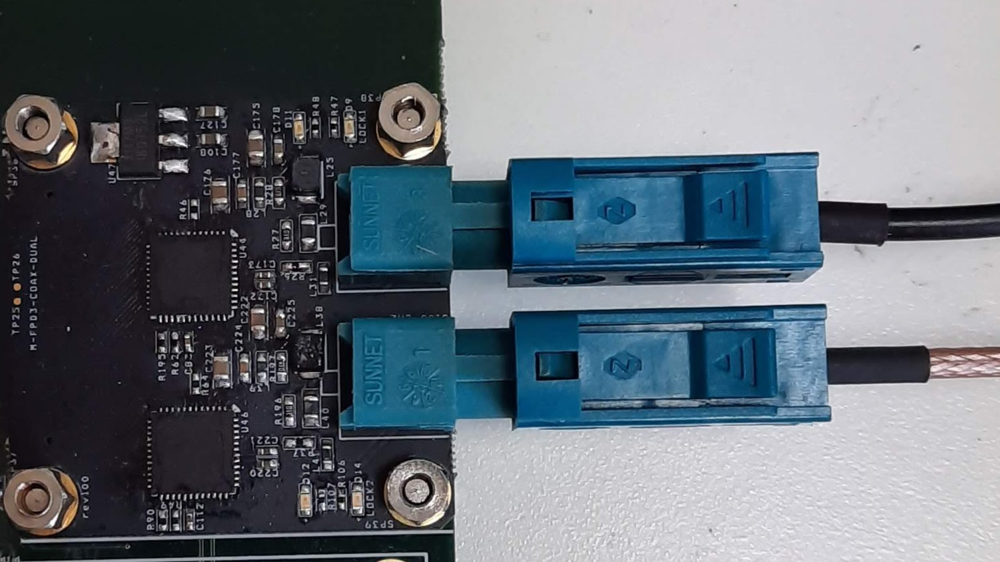

# M-FPD3-COAX-UVC
Image sensor : AR0230/AR0233, SERDES : FPD LINK3(Coaxial connector), UVC : FX3 USB3.0 UVC, ISP : AP0202/GW5200(camera side or grabber side)

FPD LINK3 camera and FPD LINK3 grabber using USB 3.0 UVC interface

 
 
 
-FPD LINK3 camera module

 
 
 
-FPD LINK3 dual grabber module

